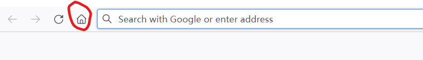
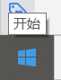
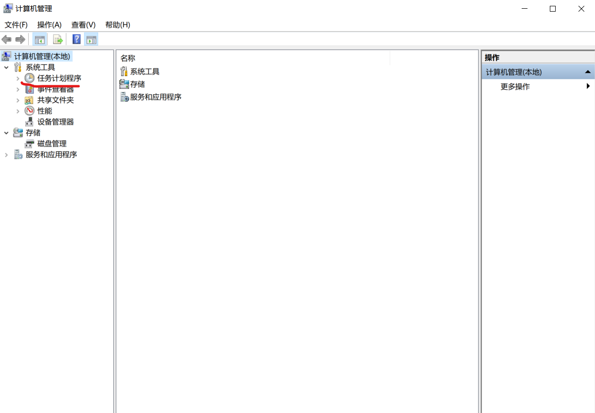
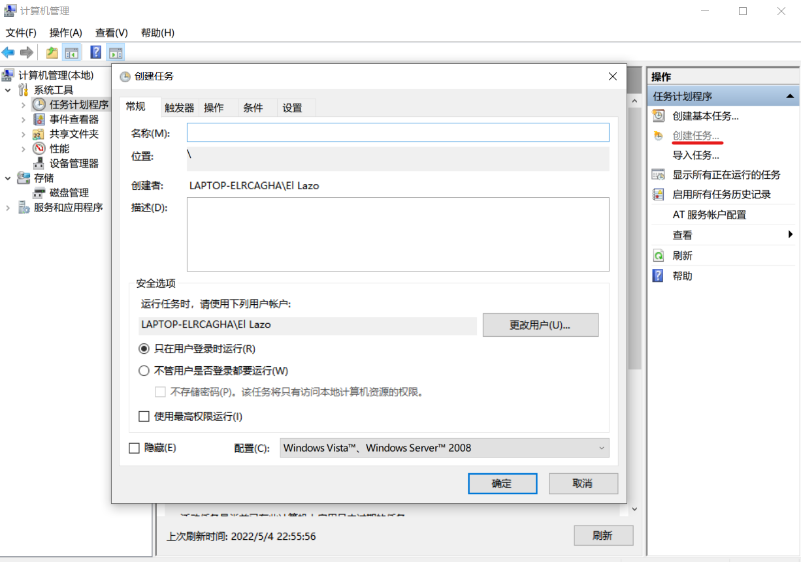
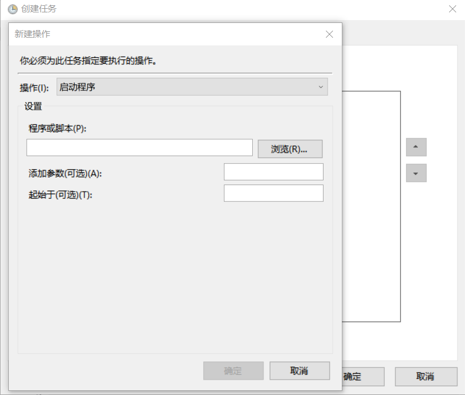
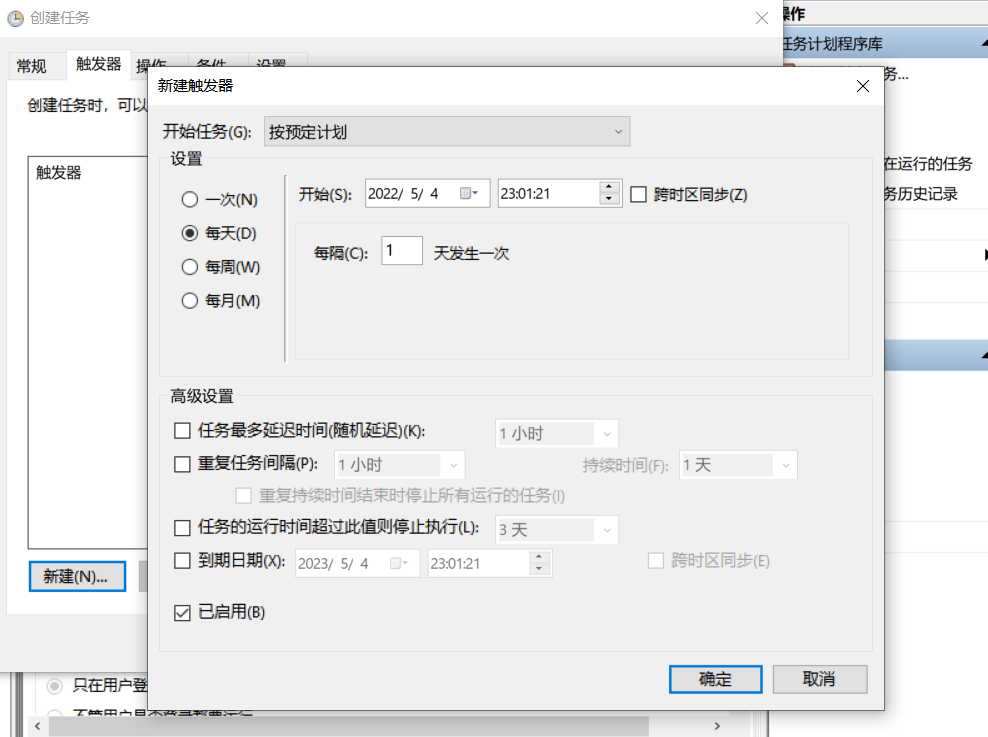
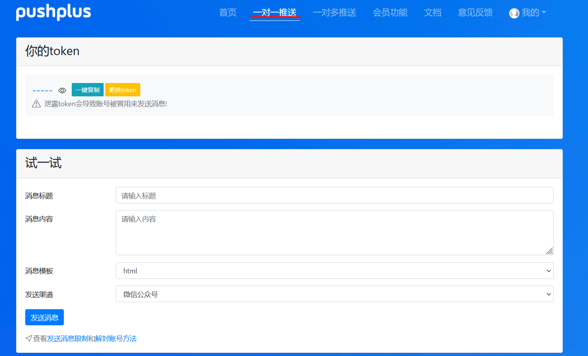
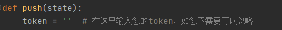

# 英明的健康打卡机制现在已经不要求了，辅导员不催了，综测也不扣了，总之没声了。估计也不太可能再实行。这个库可以归档了。

# 简介

* 基于pyautogui开发的自动完成兰州大学每日健康打卡，并通过pushplus推送结果。
* 随机延迟(30分钟内，可修改)
* 自动重试(2小时，可修改)

# 使用方法

1. clone 或者下载本仓库
2. 将browser_icon.png改为您的浏览器图标。（您可以使用win + s截屏）
3. 选取一个您浏览器输入框左侧的图标，如火狐浏览器可以选择主页按钮。将input_field1.png替换为该图标。(若无法正常输入，请修改mouse(input_field1, offset=180)中offset 处的数值，该数值为向左偏移距离。）

    
4. 您可以将您的账号密码存入浏览器中以自动输入。截图后替换account.png。  
    ​
5. 截取您浏览器的关闭按钮，替换close.png  
    ​
6. 右键单击开始。点击“计算机管理”。
7. 点击“任务计划程序”
8. 点击右侧“创建任务”  
    ​
9. 输入名称，描述（可以不输入）
10. 依次点击操作，新建。
11. “程序或脚本”处输入您python解释器的位置，参数为main.py，“起始于”处输入main.py所在位置。  
     ​
12. 点击确定。
13. 点击触发器，设置时间和重复次数。
14. 点击确定。
15. 再次点击确定，完成。

# 结果推送功能（可选）

1. 进入push plus 官网。 [www.pushplus.plus](https://www.pushplus.plus/)
2. 注册并登录。
3. 点击一对一推送。
4. 复制token，黏贴至token = ''处，保存。  
    ​

# TO-DO

* mac，Linux适配
